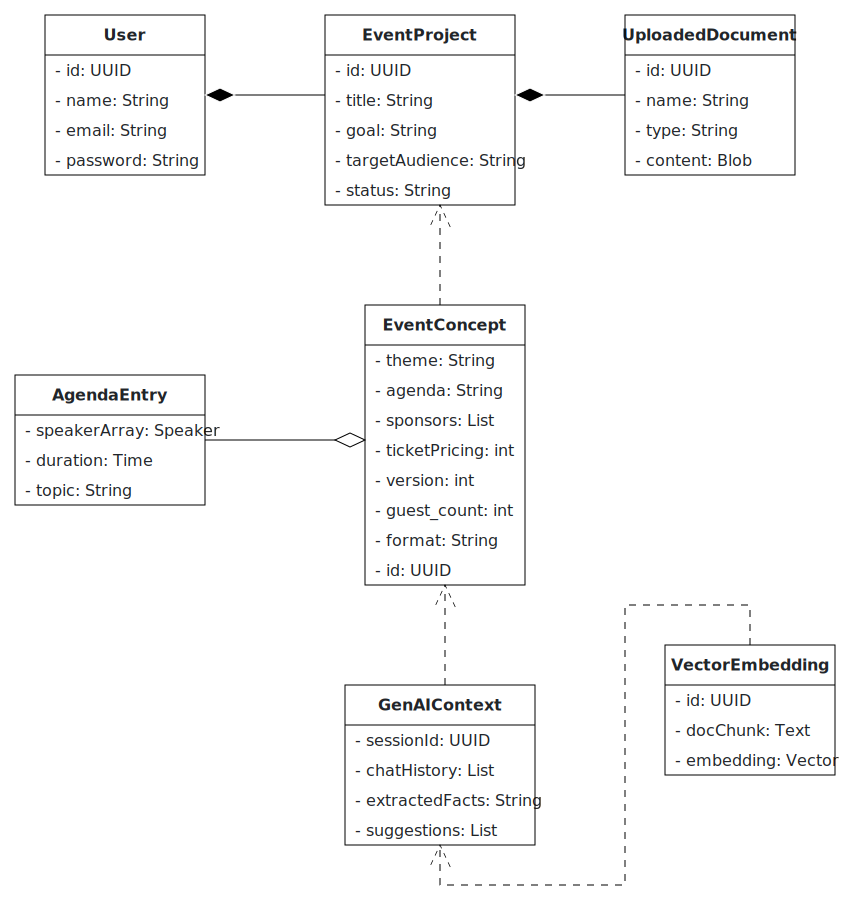

# AI Event Concepter

## 🚀 Quick Start (≤3 Commands)

```bash
git clone https://github.com/AET-DevOps25/team-git-push-force.git && cd team-git-push-force
./start-dev.sh
```

**Access the application:**
- Client (Angular frontend) at [http://localhost:4200](http://localhost:4200)
- API Gateway at [http://localhost:8080](http://localhost:8080)  
- Full stack running with real backend services

---

## Purpose

### What is the main functionality?

An interactive **co-creation assistant** that turns a vague event idea into a polished concept—fast. The planner drags in any relevant documents (past reports, industry papers, brand decks). The AI digests that material, asks follow-up questions until all gaps are filled, and delivers a full concept package: theme, format, agenda outline, speaker & sponsor suggestions, and ticket-price ideas, exportable as PDF and JSON. Because the AI does the heavy lifting—researching, matching, structuring—it **cuts days of manual work to minutes**, keeps all context in one place, and lets the planner iterate (“add a workshop,” “make it hybrid”) with a single prompt.

---

### Who are the intended users?

* **Event-agency planners** who prepare multiple client proposals.
* **Corporate planners** who must respect internal policies yet still wow stakeholders.

---

### How will you integrate GenAI meaningfully?

* **LangChain + Weaviate RAG** over *user-supplied* documents—no external scraping—so every suggestion is grounded in the customer’s own industry context.
* **Adaptive dialogue** powered by an LLM that follows nine standard conception steps, probes for missing details, remembers answers, and supports unlimited refinements.
* **Creative synthesis** prompt chains craft themes, agendas, and curated speaker/sponsor lists that reflect both uploaded content and the evolving conversation.
* **Continuous learning**—each new debrief or guideline embedded today improves tomorrow’s concepts automatically.

---

### Describe some scenarios how your app will function

**Co-create a fresh pitch** – The planner uploads last year’s debrief and a market white paper, then says “Target 300 attendees, hybrid preferred.” The AI summarises the docs, asks two clarifiers (duration, networking preference), and returns a one-day concept. The planner adds, “Include a hands-on workshop and make the theme more visionary.” The AI revises the agenda and title, then offers a ready-to-share PDF.

**Compliance-aware brainstorm** – A corporate planner supplies the company’s policy handbook and audience personas. The AI filters speaker suggestions to fit policy, proposes an online format for global reach, and crafts sponsor packages aligned with brand guidelines. When the planner asks, “Shorten it to a half-day and add a panel,” the AI updates the concept instantly.

**Learning loop** – After an event, the planner uploads debrief notes (“need stronger networking, ticket price felt high”). Next time, the AI automatically proposes an interactive networking segment and adjusted ticket tiers, then asks, “Anything else you’d like to refine?”—keeping the focus on creative improvement instead of administrative grind.

---

## 🏗 Architecture

The system follows a modular microservice architecture with clearly separated concerns across backend services, a modern web frontend, and scalable data infrastructure.

### 🔧 Component Overview

| Layer         | Technology              | Purpose                                           |
|---------------|--------------------------|---------------------------------------------------|
| API Gateway   | Spring Boot 3            | JWT authentication, routing, OpenAPI docs         |
| User Service  | Spring Boot 3            | User management, authentication, JWT tokens       |
| Concept Service| Spring Boot 3           | Event concept CRUD, PDF generation, AI integration|
| GenAI Service | Python 3.12 + LangChain  | Document ingestion, RAG pipeline, content creation|
| Web Client    | Angular 19               | Chat UI, adaptive flow, PDF viewer                |
| Relational DB | PostgreSQL               | Stores users, concepts, agenda items, speakers    |
| Vector DB     | Weaviate                 | Embeddings for trends & document chunks           |
| Object Store  | MinIO                    | Uploaded files and generated PDFs                 |
| Observability | Prometheus + Grafana     | Metrics and dashboards                            |
| Orchestration | Docker + Kubernetes      | Containerization and scalable deployment          |

---

## 📊 UML Diagrams

### 1. Analysis Object Model (UML Class Diagram)

This diagram shows the key objects and their relationships as identified during analysis.



---

### 2. Use Case Diagram

This diagram illustrates the main interactions between users and the system.


---

### 3. Top-Level Architecture (UML Component Diagram)

This diagram provides a high-level overview of the system’s components and their interactions.


---

## 📁 Repository Structure

The project is split into several main directories:

- `/api`: OpenAPI specifications (single source of truth)
- `/client`: Angular 19 frontend  
- `/gateway`: API Gateway (Spring Boot) - Routing, JWT validation, OpenAPI docs
- `/user-svc`: User Service (Spring Boot) - Authentication, user management
- `/concept-svc`: Concept Service (Spring Boot) - Event concept CRUD, PDF export
- `/genai-svc`: GenAI Service (Python/Flask/LangChain) - Document processing, RAG pipeline

## 🔄 API-First Development

This project follows an API-first development approach. All API changes start with updating the OpenAPI specifications in the `/api` directory.

### API Directory Structure

```
/api                    # API specifications (single source of truth)
  ├── gateway.yaml      # API Gateway specification  
  ├── user-service.yaml # User Service specification
  ├── concept-service.yaml # Concept Service specification
  ├── genai-service.yaml # GenAI Service specification
  ├── scripts/          # Code generation scripts
  └── README.md         # API documentation
```

### Interactive API Documentation

- **Local Development**: Run `./start-docs.sh` to launch Swagger UI for all services
- **Documentation Hub**: `docs/index.html` provides unified access to all API docs
- **Individual Specs**: Each service OpenAPI spec can be viewed independently

### API-First Engineering Process  
1. **Design**: Update OpenAPI specifications first
2. **Validate**: Automated linting and specification validation  
3. **Generate**: Code generation from specifications
4. **Test**: API contract testing and validation
5. **Deploy**: Automated CI/CD pipeline deployment

**Engineering Process Evidence:**
- ✅ **Documented Requirements**: Clear API contracts in `/api` directory
- ✅ **Architecture Models**: UML diagrams (Analysis Object Model, Use Case, Component)
- ✅ **API-First Workflow**: Specifications drive implementation
- ✅ **Automated Validation**: Pre-commit hooks and CI pipeline checks

---


## 🧪 Testing & CI/CD Automation

### Test Coverage & Automation
- **Unit Tests**: JUnit (Java), pytest (Python), Jasmine (Angular)
- **Integration Tests**: Database operations, API endpoints, service interactions  
- **CI Pipeline**: GitHub Actions runs tests automatically on PR and merge
- **Coverage Tools**: JaCoCo (Java), pytest-cov (Python), ng test (Angular)

### Automated Testing in CI
- **On Pull Request**: Lint, unit tests, API validation
- **On Merge**: Full test suite, integration tests, deployment
- **API-First Validation**: OpenAPI spec validation and code generation verification

See [Testing Strategy](./TESTING.md) for detailed coverage and methodology.

## ⚙️ Prerequisites

- [Node.js](https://nodejs.org/) (v22+), Java JDK 21+, Docker, Git
- **All dependencies auto-installed** by setup scripts

## 🔧 Development Options

### Environment Flexibility
```bash
# Development (default)
./start-dev.sh

# Staging environment  
CLIENT_BUILD_ENV=staging docker-compose up --build

# Production environment
CLIENT_BUILD_ENV=production docker-compose up --build
```

### Manual Service Development
For individual service development, see respective service READMEs:
- [Gateway Service](./gateway/README.md) - `./gradlew bootRun --args='--spring.profiles.active=local'`
- [User Service](./user-svc/README.md) - `./gradlew bootRun` 
- [Concept Service](./concept-svc/README.md) - `./gradlew bootRun`
- [GenAI Service](./genai-svc/README.md) - `python app.py`
- [Client App](./client/README.md) - `ng serve`

---

## 📚 Documentation

### Core Documentation
- **[API Specifications](./api/README.md)** - OpenAPI specs and API-first development
- **[API Documentation Hub](./docs/index.html)** - Interactive Swagger UI for all services
- **[Infrastructure & Deployment](./infrastructure/README.md)** - Terraform, Ansible, CI/CD setup
- **[Monitoring](./helm/monitor/README.md)** - Prometheus, Grafana, alerting

### Service Documentation
- **[Concept Service](./concept-svc/README.md)** - Event concepts, PDF generation
- **[User Service](./user-svc/README.md)** - User management, authentication, JWT tokens
- **[GenAI Service](./genai-svc/README.md)** - LangChain integration, AI-powered features
- **[Gateway Service](./gateway/README.md)** - API routing, JWT authentication
- **[Client App](./client/README.md)** - Angular frontend, environment configuration

### Development & Testing
- **[Testing Strategy](./TESTING.md)** - Test coverage, CI automation, GenAI testing
- **[GenAI Testing](./genai-svc/tests/README.md)** - Conversation history and concept suggestion tests
- **[Helm Deployment](./helm/ai-event-concepter/README.md)** - Kubernetes deployment guide

### Team Responsibilities
Based on [CODEOWNERS](./.github/CODEOWNERS):
- **@lenni108**: API specs (shared), Angular client, concept service, infrastructure, documentation
- **@sfdamm**: Gateway, GenAI service, CI/CD workflows, Helm charts, API specs (shared), documentation
- **@ClaudiaDuenzinger**: User service, monitoring stack, documentation
